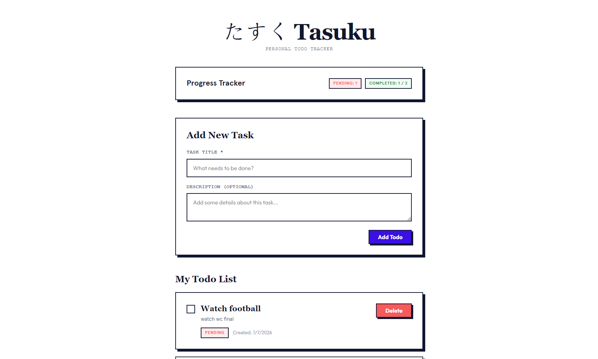
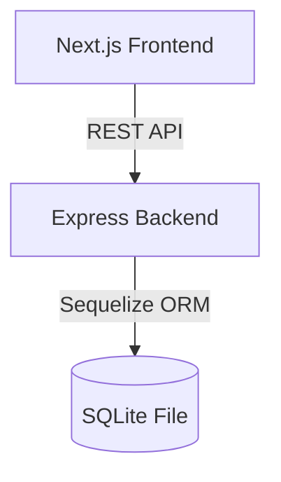

# Project Tasuku (タスク)

Todo tracker for SE intern task



---

## 1. Local Deployment Tutorial

Follow these steps to run(must have node and npm).

### Step 1: Set Up Backend Environment Configuration

Navigate to the `backend/` directory and set up environment variables:

```bash
cd backend
npm install
copy .env.example .env
```

The backend is configured using the following environment variables:

| Variable   | Description                                    | Default       |
| :--------- | :--------------------------------------------- | :------------ |
| `PORT`     | The port the Express.js API server will run on | `3001`        |
| `NODE_ENV` | Environment mode (development / production)    | `development` |

### Step 2: Run Database Migrations

Use the Sequelize CLI to initialize the SQLite database and migration:

```bash
npx sequelize-cli db:migrate
```

This will automatically create a local `database.sqlite` file in the root of the `backend/` directory and set up the `Todos` table.

### Step 3: Start the Express Backend API

Run the backend:

```bash
npm run dev
```

The backend server will be at [http://localhost:3001](http://localhost:3001).

### Step 4: Set Up Frontend Environment Configuration

Navigate to the `frontend/` directory and configure the API endpoint environment:

```bash
cd ../frontend
npm install --legacy-peer-deps
copy .env.example .env
```

The frontend uses the following environment variable:

| Variable              | Description                             | Default                 |
| :-------------------- | :-------------------------------------- | :---------------------- |
| `NEXT_PUBLIC_API_URL` | URL pointing to the Express API backend | `http://localhost:3001` |

### Step 5: Start the Next.js Frontend App

Run the frontend:

```bash
npm run dev
```

Open [http://localhost:3000](http://localhost:3000) on your browser to start managing your daily task checklists!

---

## 2. Architecture Choice

### 2.1 Architectural Decisions

- **Decoupled Client-Server:** Next.js frontend handles UI/state; Express backend handles the API and database.
- **SQLite & Sequelize:** SQLite is a zero-setup file database. Sequelize ORM handles queries, model validations, and migrations.
- **React Query:** Manages fetching and cache invalidation automatically when tasks are added, toggled, or deleted.
- **Codecademy Gamut:** Styled components and CSS layouts provide the visual theme.

### 2.2 System Flow



---

## 3. Validation & Error Handling

### 3.1 Backend

- **Title Validation:** `POST` and `PUT` endpoints reject empty or missing titles with a `400` status.
- **Not Found Checks:** Updates or deletes on non-existent IDs return `404`.
- **Global Error Handler:** Catches unhandled exceptions and returns a `500` status without crashing the process.

### 3.2 Frontend

- **Form Check:** Blocks submission of empty titles.
- **Error Alerts:** Displays API/network errors in a custom alert bar.
- **Disable State:** Disables buttons during mutations to prevent double-clicks.

---

## 4. Possible Improvements

1. **User Auth:** Add JWT or NextAuth.js for private user sessions.
2. **Organization:** Support categories, tags, or sorting.
3. **Due Dates:** Add deadlines and task reminders.
4. **Production DB:** Switch from SQLite to PostgreSQL/MySQL.
5. **API Pagination & Search:** Implement pagination and text search for large lists.
6. **Drag-and-Drop:** Allow task reordering in the UI.
